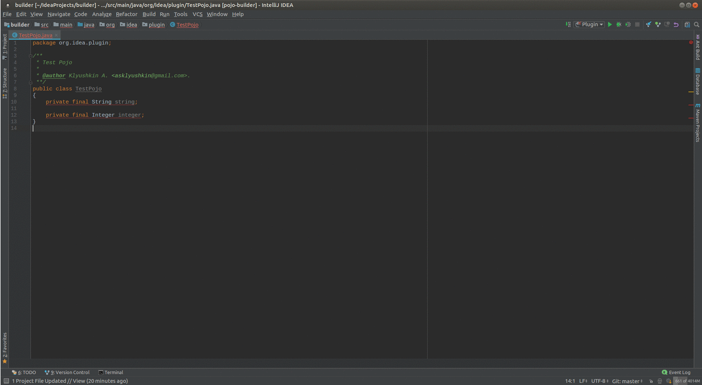

PojoBuilder 
============
Еще одна имплементация плагина для [IDEA](http://plugins.jetbrains.com/plugin/10516-pojo-builder), реализуещго паттерн Builder.

Умеет расставлять Objects.requireNonNull и аннотации для Jackson'а.

### Change notes
#### 16.03.2018 - 1.1 - bug fixing 
* fix builder class private access 

#### 09.03.2018 - 1.0 - First release
**В обычном режиме**

* добавляет Objects.requireNonNull в конструктор.
 
**В режиме Jackson**
 
* проставляет @JacksonCreator над конструктором
* проставляет @JsonProperty над параметрами конструктора
* проставляет @JsonProperty над геттерами. 
* добавляет Objects.requireNonNull в build методе Builder'а.

### Пример использования

###  Установка

Plugins -> Install plugin from disk... -> [pojobuilder.jar](pojobuilder.jar)

Или с офф. сайта [IDEA Plugin](http://plugins.jetbrains.com/plugin/10516-pojo-builder)

### License

Licensed under the [Apache License, Version 2.0](http://www.apache.org/licenses/LICENSE-2.0).

[Aleksandr Kliushkin](mailto:asklyushkin@gmail.com).
